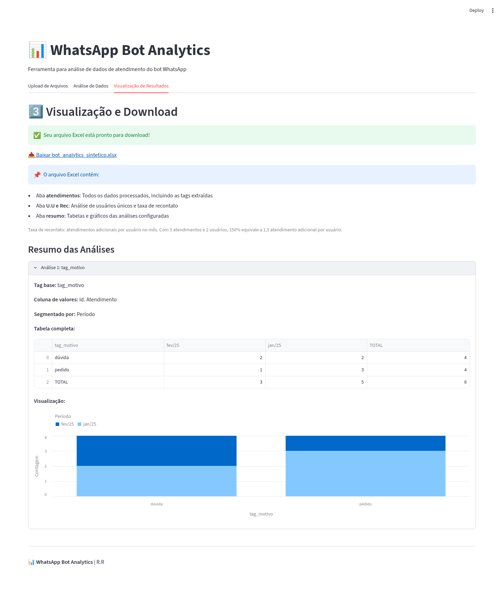

# WhatsApp Bot Analytics

O Bot Analytics surgiu da necessidade de organizar exportações de atendimentos e reduzir a consolidação manual da análise mensal. A aplicação local em Streamlit reúne os CSVs, calcula indicadores e segmentações e gera um Excel com tabelas e gráficos editáveis.

**CSVs → deduplicação e extração de tags → indicadores e segmentações → Excel com tabelas e gráficos.**

O projeto tem registros de desenvolvimento em abril e agosto de 2025. O exemplo incluído permite conhecer suas funcionalidades e reproduzir a análise com dados inteiramente sintéticos.

Para conhecer a entrega antes de instalar, baixe o [Excel do exemplo sintético](examples/bot_analytics_sintetico.xlsx), gerado pela aplicação com a configuração descrita abaixo.



## Funcionalidades

- Receber um ou vários CSVs e concatená-los na ordem dos uploads.
- Remover duplicatas de `Id. Atendimento`, preservando a primeira ocorrência.
- Derivar hora, dia da semana, período mensal e trimestre a partir de `Data`.
- Extrair as tags presentes em `Propriedades` para colunas próprias.
- Calcular atendimentos, usuários únicos, recontato e média por usuário em cada mês.
- Configurar contagens de valores distintos por tag, com segmentação opcional por outra coluna.
- Exportar os dados tratados, indicadores e análises para Excel, com filtros, tabelas formatadas e gráficos nativos.

## Instalação e execução

Requisitos: Python, `venv` e `pip`. A interface usa Streamlit e Altair; o tratamento dos dados usa pandas, e a exportação usa openpyxl. Ambiente de referência no Linux: **Python 3.10.12, Streamlit 1.65.0, Altair 6.2.2, pandas 2.3.3 e openpyxl 3.1.5**. Instale as dependências declaradas em `requirements.txt`; o manifesto usa versões mínimas, sem fixar todo o ambiente.

Na raiz do projeto, em um terminal Bash:

```bash
python3 -m venv .venv
source .venv/bin/activate
python -m pip install -r requirements.txt
streamlit run app.py
```

Abra o endereço local informado no terminal. Para encerrar, use `Ctrl+C`; para sair do ambiente virtual, `deactivate`.

No PowerShell, a ativação equivalente é `.venv\Scripts\Activate.ps1`. As demais instruções usam arquivos relativos à raiz do projeto.

## Executar o exemplo sintético

O arquivo [examples/atendimentos_sinteticos.csv](examples/atendimentos_sinteticos.csv) contém **somente registros fictícios** e usa `latin1` com separador `;`. Um arquivo é suficiente para a demonstração.

1. Na aba **Upload de Arquivos**, selecione o CSV sintético.
2. Em **Nome do arquivo de saída**, informe `bot_analytics_sintetico` e clique em **Processar Arquivos**.
3. Na aba **Análise de Dados**, escolha `tag_motivo` em **Tag para análise** e `Id. Atendimento` em **Coluna para contar**.
4. Marque **Segmentar os dados** e selecione `Período` em **Coluna para segmentar**.
5. Clique em **Adicionar Análise**, depois em **Gerar Excel com Análises**.
6. Na aba **Visualização de Resultados**, confira a tabela e baixe o Excel. Abra-o em um editor de planilhas compatível com `.xlsx`.

Essas etapas usam a mesma configuração do Excel apresentado acima. Compare as tabelas geradas com os resultados esperados abaixo.

### Resultados esperados

O CSV tem **9 linhas de dados**, incluindo uma repetição de `AT-SIM-003`. Após a deduplicação ficam **8 atendimentos**, de **3 identificadores fictícios** no conjunto completo. Um mesmo identificador pode aparecer em mais de um mês.

| Período | Atendimentos | Usuários únicos no mês | Recontato | Média por usuário |
|---|---:|---:|---:|---:|
| jan/25 | 5 | 2 | 150,00% | 2,50 |
| fev/25 | 3 | 2 | 50,00% | 1,50 |

A análise de `tag_motivo`, contando `Id. Atendimento` e segmentando por `Período`, produz:

| Motivo | fev/25 | jan/25 | TOTAL |
|---|---:|---:|---:|
| dúvida | 2 | 2 | 4 |
| pedido | 1 | 3 | 4 |
| TOTAL | 3 | 5 | 8 |

O gráfico da interface mostra **4 atendimentos por motivo**, divididos entre os dois meses. A linha e a coluna agregadas `TOTAL` aparecem na tabela, mas não compõem os gráficos da interface ou do Excel. A ordem das colunas da tabela segue o agrupamento atual, sem ordenação cronológica.

## Formato de entrada

Cada arquivo deve ter cabeçalho, usar **ponto e vírgula (`;`)** como separador e **latin1 (ISO-8859-1)** como codificação. Os nomes das colunas precisam corresponder exatamente aos abaixo:

| Coluna obrigatória | Conteúdo | Exemplo sintético |
|---|---|---|
| `Id. Atendimento` | Identificador usado na deduplicação e contagem | `AT-SIM-001` |
| `Data` | Data e hora; o parser usa `dayfirst=True` | `05/01/2025 09:00:00` |
| `Identificação` | Identificador do usuário | `usuario-sintetico-01` |
| `Propriedades` | Tags e valores no formato esperado pelo extrator | `tag_motivo:dúvida \| tag_status:resolvido \|` |

Colunas adicionais são preservadas e podem ser usadas nas contagens ou na segmentação. A deduplicação é feita no conjunto concatenado, antes dos indicadores mensais: IDs iguais em arquivos diferentes conservam a primeira ocorrência, mesmo se outros campos diferirem.

O extrator detecta nomes iniciados por `tag_` e espera `tag_nome:valor |`. **Inclua o delimitador `|` também depois da última tag**: o extrator atual não captura o último valor sem esse delimitador.

Antes do upload, confira os cabeçalhos e preencha os identificadores de atendimento e usuário. Identificações ausentes podem afetar a contagem de usuários únicos. Use datas válidas: valores não reconhecidos tornam-se ausentes e ficam fora dos indicadores mensais; uma entrada sem datas válidas pode falhar no processamento.

## Experimente uma cópia do CSV

Na raiz do projeto, crie uma cópia para modificar:

```bash
cp examples/atendimentos_sinteticos.csv atendimentos-experimento.csv
```

Edite a cópia mantendo **latin1 (ISO-8859-1)**, o separador `;`, os quatro cabeçalhos e o delimitador `|` após cada tag. Ao exportar de um editor ou planilha, selecione explicitamente essa codificação e esse separador. Use identificadores fictícios novos para acrescentar atendimentos; repetir `Id. Atendimento` conserva somente a primeira ocorrência.

Faça upload da cópia e clique em **Processar Arquivos**. Para experimentar outra análise, escolha `tag_status` em **Tag para análise**, `Id. Atendimento` em **Coluna para contar** e `Período` na segmentação. Clique em **Adicionar Análise** e em **Gerar Excel com Análises** para obter a nova saída.

## Indicadores e contagens

Os indicadores seguem estas definições:

- **Atendimentos por mês:** quantidade de `Id. Atendimento` distintos com aquele `Período`.
- **Usuários únicos por mês:** o código conserva uma linha por `Identificação` no mês e conta os IDs de atendimento correspondentes.
- **Taxa de recontato:** nome histórico do indicador de atendimentos adicionais por usuário no mês. Fórmula: `(atendimentos − usuários únicos) / usuários únicos × 100`; se não houver usuários únicos, retorna zero.
- **Média de atendimentos por usuário:** `atendimentos / usuários únicos`; se não houver usuários únicos, retorna zero.
- **Análises por tag:** contagem de valores distintos (`nunique`) da coluna escolhida em cada categoria, com segmentação opcional. Os totais também usam valores distintos; sua soma pode diferir das parcelas quando a mesma identificação aparece em mais de uma categoria ou segmento.

O denominador da taxa de recontato é **usuários únicos**, por isso o resultado pode superar 100%. No exemplo de janeiro, 5 atendimentos e 2 usuários resultam em `(5 − 2) / 2 × 100 = 150%`, equivalentes a **1,5 atendimento adicional por usuário** no mês. O indicador não expressa a porcentagem de usuários que retornaram.

## Exportação e troca de arquivos

O Excel contém três abas:

- **`atendimentos`:** registros deduplicados, colunas derivadas e tags extraídas.
- **`U.U e Rec`:** indicadores mensais. Percentuais e médias são armazenados como texto formatado, por exemplo `150.00%` e `2.50`.
- **`resumo`:** tabelas das análises configuradas e gráficos nativos de barras/colunas. Os agregados identificados exatamente como `TOTAL` ficam nas tabelas e são excluídos dos gráficos; categorias como `perda total` são preservadas. É necessário adicionar pelo menos uma análise para gerar o arquivo pela interface.

Abra o arquivo em um editor compatível com `.xlsx`. A aparência e a edição dos gráficos dependem do editor de planilhas; compare os valores das tabelas com as prévias do exemplo.

Os uploads são lidos em memória. Quando os arquivos mudam, inclusive com **nomes iguais e conteúdos diferentes**, os dados processados, análises e Excel anteriores são descartados: processe e configure novamente. Remover os uploads também limpa esses resultados. Reprocessar a mesma entrada reinicia as análises; adicionar ou remover uma análise exige gerar o Excel novamente. O link de download permanece válido entre reruns da mesma sessão.

## Testes

Com o ambiente virtual ativo:

```bash
python -m pip check
python -m unittest discover -s tests -v
```

Os testes usam a API AppTest do Streamlit com uploads sintéticos. Conferem indicadores e tabelas, contagens do gráfico da interface, referências dos gráficos do Excel e preservação de categorias como `perda total`. Também verificam download após rerun, preservação de arquivo local, múltiplos uploads, troca de conteúdo com o mesmo nome e invalidação da exportação.

## Arquivos do projeto

| Caminho | Função |
|---|---|
| `app.py` | Interface, tratamento dos CSVs, indicadores e exportação |
| `requirements.txt` | Dependências Python declaradas |
| `.streamlit/config.toml` | Configuração do Streamlit |
| `examples/` | CSV sintético e Excel de referência |
| `docs/images/` | Captura real da aplicação |
| `tests/test_app.py` | Verificações de regressão com dados sintéticos |
